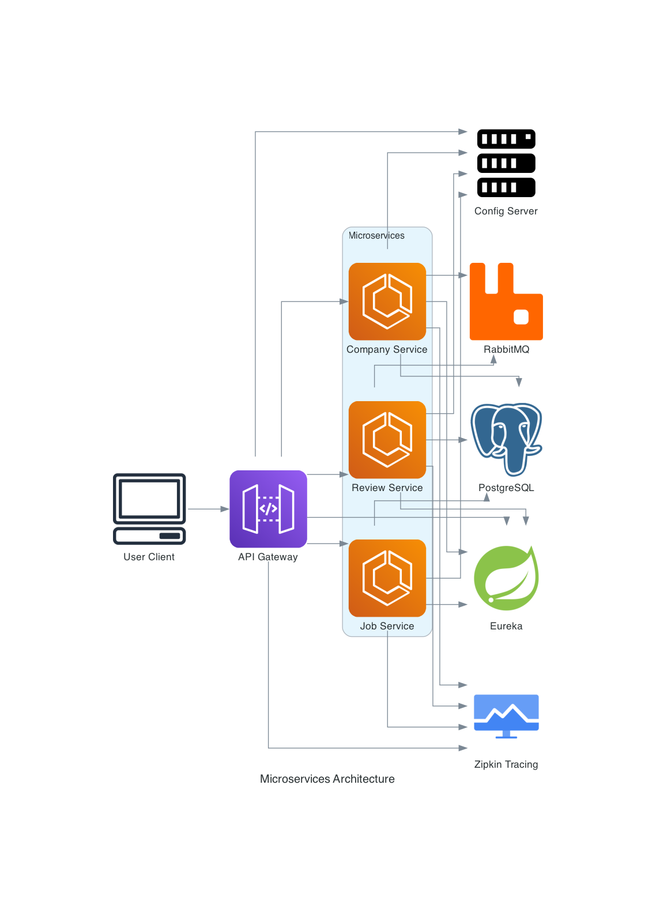

# Job Board Microservices

A microservices-based job board application built with Spring Boot, Spring Cloud, and Docker. This project demonstrates scalable service-oriented architecture with service discovery, API gateway, centralized configuration, and inter-service communication.

## Table of Contents

- [Architecture](#architecture)
- [Services](#services)
- [Tech Stack](#tech-stack)
- [Getting Started](#getting-started)
- [Running the Application](#running-the-application)
- [API Endpoints](#api-endpoints)
- [Development](#development)

## Architecture



- **Gateway**: API Gateway for routing and rate limiting.
- **Config Server**: Centralized configuration management.
- **Service Registry**: Eureka server for service discovery.
- **Company Service**: Manages company data and ratings.
- **Job Service**: Manages job postings and aggregates company/review data.
- **Review Service**: Manages company reviews and ratings.
- **RabbitMQ**: Message broker for asynchronous communication.
- **PostgreSQL**: Database for persistent storage.
- **Zipkin**: Distributed tracing.

## Services

| Service         | Port  | Description                |
|-----------------|-------|----------------------------|
| Gateway         | 8084  | API Gateway                |
| Config Server    | 8888  | Centralized Config         |
| Service Registry| 8761  | Eureka Discovery           |
| Company Service | 8082  | Company Management         |
| Job Service     | 8081  | Job Management             |
| Review Service  | 8083  | Review Management          |
| PostgreSQL      | 5432  | Database                   |
| RabbitMQ        | 5672  | Message Broker             |
| Zipkin          | 9411  | Distributed Tracing        |

## Tech Stack

- Java 21, Spring Boot 3.5.x
- Spring Cloud (Eureka, Config, Gateway, OpenFeign)
- PostgreSQL
- RabbitMQ
- Docker & Docker Compose
- Zipkin (Tracing)
- Micrometer, Actuator

## Getting Started

### Prerequisites

- Java 21+
- Docker & Docker Compose
- Gradle

### Clone the Repository

```sh
git clone https://github.com/yourusername/job-board-microservices.git
cd job-board-microservices
```

### Configuration

- Configuration files are managed via the [Config Server](config-server/).
- Update database credentials in `application.yml` or via config repo as needed.

### Start Infrastructure (DB, RabbitMQ, Zipkin)

```sh
docker-compose up -d
```

### Run All Microservices using Terminal

In separate terminals, start each service:

```sh
cd config-server && ./gradlew bootRun
cd service-reg && ./gradlew bootRun
cd gateway && ./gradlew bootRun
cd companyms && ./gradlew bootRun
cd jobms && ./gradlew bootRun
cd reviewms && ./gradlew bootRun
```
OR

### Run All Microservices Using IntelliJ IDEA

1. Open the project root folder in IntelliJ IDEA.
2. In the Project view, locate each microservice module (e.g., `config-server`, `service-reg`, `gateway`, `companyms`, `jobms`, `reviewms`).
3. For each service:
    - Right-click the main class inside the `src/main/java` directory.
    - Select **Run main class**.
4. Repeat for all services so each runs in its own tab or window.

> **Tip:** You can also create a [Run Configuration](https://www.jetbrains.com/help/idea/run-debug-configuration.html) for each service for easier startup in the future.

## API Endpoints

### Gateway

| Method | Path                | Description           |
|--------|---------------------|-----------------------|
| Any    | `/companies/**`     | Proxies to Company Service |
| Any    | `/jobs/**`          | Proxies to Job Service     |
| Any    | `/reviews/**`       | Proxies to Review Service  |

### Company Service (`/companies`)

| Method | Path              | Description                  |
|--------|-------------------|------------------------------|
| GET    | `/companies`      | Get all companies            |
| POST   | `/companies`      | Create a new company         |
| GET    | `/companies/{id}` | Get company by ID            |
| PUT    | `/companies/{id}` | Update company by ID         |
| DELETE | `/companies/{id}` | Delete company by ID         |

### Job Service (`/jobs`)

| Method | Path            | Description                  |
|--------|-----------------|------------------------------|
| GET    | `/jobs`         | Get all jobs                 |
| POST   | `/jobs`         | Create a new job             |
| GET    | `/jobs/{id}`    | Get job by ID                |
| PUT    | `/jobs/{id}`    | Update job by ID             |
| DELETE | `/jobs/{id}`    | Delete job by ID             |

### Review Service (`/reviews`)

| Method | Path                        | Description                        |
|--------|-----------------------------|-------------------------------------|
| GET    | `/reviews?companyId={id}`   | Get all reviews for a company       |
| POST   | `/reviews?companyId={id}`   | Add a review for a company          |
| GET    | `/reviews/{reviewId}`       | Get review by ID                    |
| PUT    | `/reviews/{reviewId}`       | Update review by ID                 |
| DELETE | `/reviews/{reviewId}`       | Delete review by ID                 |
| GET    | `/reviews/averageRating?companyId={id}` | Get average rating for a company |


## Development

- Access Eureka dashboard at `http://localhost:8761/`
- Access Zipkin UI at `http://localhost:9411/`